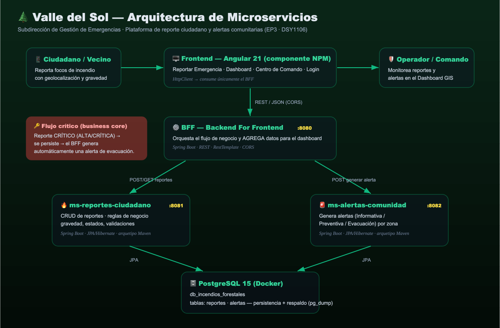
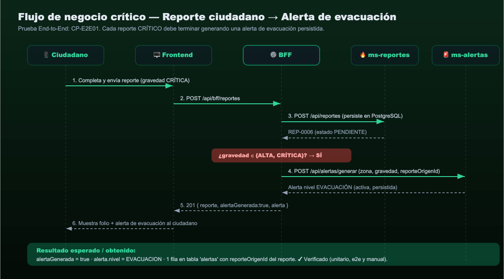

\newpage

# 1. Introducción

**Asignatura:** Desarrollo Fullstack III (DSY1106)
**Docente:** Israel Alejandro Villagra Riquelme
**Caso:** Municipalidad Valle del Sol — Subdirección de Gestión de Emergencias (incendios forestales).
**Integrantes:** Matías Ampuero, Tomás Escobar.

Este informe documenta la **estrategia, ejecución y resultados de las pruebas** realizadas sobre la solución de microservicios de Valle del Sol como parte de la Evaluación Parcial 3. El objetivo de esta etapa fue **integrar los componentes frontend y backend**, garantizar la **comunicación vía API REST con persistencia de datos** y **respaldar el funcionamiento mediante pruebas unitarias, de integración y end-to-end**, priorizando los procesos de negocio más críticos (*business core*).

Tal como se indicó en clases, las pruebas **no se limitan al "camino feliz"**: se diseñaron casos orientados a **encontrar errores, validar entradas inválidas y detectar vulnerabilidades de uso** en los puntos críticos del negocio. Se documenta además un **bug detectado por las pruebas y su corrección** (BUG-01).

# 2. Arquitectura de la solución

La arquitectura definida en las EP1 y EP2 se mantiene; en la EP3 se completó su **implementación e integración real con persistencia**. La solución se compone de cuatro componentes desplegables y una base de datos:

| Componente | Tecnología | Puerto | Rol |
|---|---|---|---|
| `frontend-valle-sol` | Angular 21 (componente NPM) | 4200 | Interfaz ciudadano + Centro de Comando. Consume **solo** el BFF. |
| `bff-valle-sol` | Spring Boot (arquetipo Maven) | 8080 | Backend For Frontend: **orquesta** el flujo de negocio y **agrega** datos para el dashboard. |
| `ms-reportes-ciudadano` | Spring Boot + JPA | 8081 | Microservicio de reportes ciudadanos. |
| `ms-alertas-comunidad` | Spring Boot + JPA | 8082 | Microservicio Motor de Alertas a la Comunidad. |
| PostgreSQL 15 | Docker | 5434 | Persistencia (`db_incendios_forestales`: tablas `reportes`, `alertas`). |



La comunicación entre componentes es **REST/JSON**. El frontend habla únicamente con el BFF (patrón *Backend For Frontend*); el BFF orquesta a los dos microservicios; cada microservicio persiste su información en PostgreSQL mediante JPA/Hibernate.

# 3. Identificación del *business core* (proceso crítico de negocio)

El caso de Valle del Sol busca **reducir el tiempo de detección de incendios** y **alertar oportunamente a la comunidad**. El proceso de negocio más crítico es:

> **Un ciudadano reporta un foco de incendio → el reporte se persiste → si su gravedad es ALTA o CRÍTICA, el sistema genera automáticamente una alerta comunitaria (preventiva o de evacuación) para la zona afectada.**

Este flujo atraviesa los tres componentes backend (frontend → BFF → ms-reportes → ms-alertas → PostgreSQL) y es el foco de las pruebas de integración y end-to-end.



# 4. Estrategia de pruebas

Se aplicó la **pirámide de pruebas**, con mayor cantidad de pruebas unitarias (rápidas y aisladas) y pruebas de integración y end-to-end sobre los puntos críticos:

| Nivel | Qué valida | Herramientas | Aislamiento |
|---|---|---|---|
| **Unitarias** | Reglas de negocio puras (sin BD ni red). | JUnit 5, Mockito, AssertJ | Repositorios/clientes simulados (mocks). |
| **Integración** | Camino REST → Servicio → Repositorio → BD. | Spring Boot Test, MockMvc, **H2** en memoria | Contexto Spring real, base H2 (modo PostgreSQL). |
| **End-to-End** | Flujo de negocio completo a través del BFF. | Spring Boot Test, MockMvc, **MockRestServiceServer** | Microservicios simulados a nivel HTTP. |
| **E2E manual** | Sistema completo en ejecución. | `curl` / script `prueba-e2e.sh` | Sistema real (Docker + 3 servicios). |

**Cobertura:** medida con **JaCoCo** (combina ejecución de pruebas unitarias y de integración/e2e).

# 5. Entorno de pruebas

| Elemento | Versión |
|---|---|
| Java (JDK) | Temurin 21 (LTS) |
| Spring Boot | 3.1.5 |
| Maven | 3.9.x |
| Base de datos (ejecución) | PostgreSQL 15 (Docker) |
| Base de datos (pruebas integración) | H2 en memoria, modo PostgreSQL |
| Node / Angular | Node 24 · Angular 21 |
| Cobertura | JaCoCo 0.8.11 |

Ejecución de todas las pruebas por microservicio:

```bash
cd ms-reportes-ciudadano && mvn clean verify   # unitarias + integración + cobertura
cd ms-alertas-comunidad  && mvn clean verify
cd bff-valle-sol         && mvn clean verify    # unitarias + end-to-end
```

# 6. Casos de prueba unitarios

Validan las **reglas de negocio** de forma aislada (mocks). El repositorio/cliente nunca toca BD ni red.

### 6.1 `ms-reportes-ciudadano` — `ReporteServiceTest`

| ID | Caso | Entrada | Resultado esperado | Estado |
|---|---|---|---|---|
| CP-U01 | Criticidad por gravedad | ALTA / CRÍTICA / MEDIA / BAJA | ALTA y CRÍTICA → crítico; resto → no crítico | ✔ |
| CP-U02 | Estado inicial y fecha | Reporte válido | Estado `PENDIENTE` + `fechaCreacion` asignada | ✔ |
| CP-U03 | Latitud fuera de rango (200) | lat=200 | `ReporteInvalidoException`, **no** persiste | ✔ |
| CP-U04 | Longitud fuera de rango | lon=−500 | `ReporteInvalidoException` | ✔ |
| CP-U05 | Descripción demasiado corta | "humo" (<10) | `ReporteInvalidoException` | ✔ |
| CP-U06 | Cambiar estado inexistente | id=99 | `RecursoNoEncontradoException` | ✔ |
| CP-U07 | Transición inválida | RESUELTO → PENDIENTE | `ReporteInvalidoException`, no persiste | ✔ |
| CP-U08 | Transición válida | PENDIENTE → VALIDADO | Estado actualizado + persistido | ✔ |

### 6.2 `ms-alertas-comunidad` — `AlertaServiceTest`

| ID | Caso | Entrada | Resultado esperado | Estado |
|---|---|---|---|---|
| CP-U09 | Mapeo nivel crítico | gravedad CRÍTICA | nivel `EVACUACION` | ✔ |
| CP-U10 | Mapeo nivel alto | gravedad ALTA | nivel `PREVENTIVA` | ✔ |
| CP-U11 | Mapeo nivel bajo | MEDIA / BAJA | nivel `INFORMATIVA` | ✔ |
| CP-U12 | Gravedad nula | null | `AlertaInvalidaException` | ✔ |
| CP-U13 | Generar desde reporte crítico | reporte CRÍTICA, zona | Alerta **activa**, EVACUACION, con `reporteOrigenId` | ✔ |
| CP-U14 | Generar sin zona | zona en blanco | `AlertaInvalidaException`, no persiste | ✔ |

### 6.3 `bff-valle-sol` — `OrquestadorServiceTest`

| ID | Caso | Entrada | Resultado esperado | Estado |
|---|---|---|---|---|
| CP-U15 | Reporte crítico orquesta alerta | gravedad CRÍTICA | Llama a ms-alertas; `alertaGenerada=true` | ✔ |
| CP-U16 | Reporte no crítico | gravedad MEDIA | **No** llama a ms-alertas; `alertaGenerada=false` | ✔ |
| CP-U17 | Agregación de dashboard | 4 reportes + 2 alertas | Totales, críticos y conteo por gravedad correctos | ✔ |

# 7. Casos de prueba de integración (REST + persistencia)

Levantan el contexto Spring completo contra **H2 en memoria**, validando el camino REST → Servicio → Repositorio → BD.

### 7.1 `ms-reportes-ciudadano` — `ReporteControllerIT`

| ID | Caso | Método | Resultado esperado | Estado |
|---|---|---|---|---|
| CP-I01 | Crear y **persistir** reporte | POST /api/reportes | 201, `Location`, 1 fila en BD | ✔ |
| CP-I02 | Coordenadas inválidas | POST (lat=200) | 400, **no** persiste | ✔ |
| CP-I03 | Descripción vacía | POST | 400 (validación de entrada) | ✔ |
| CP-I04 | Crear → consultar por id | POST + GET /{id} | Devuelve el mismo reporte y su folio | ✔ |
| CP-I05 | Consultar inexistente | GET /{id}=9999 | 404 | ✔ |

### 7.2 `ms-alertas-comunidad` — `AlertaControllerIT`

| ID | Caso | Método | Resultado esperado | Estado |
|---|---|---|---|---|
| CP-I06 | Generar y persistir alerta | POST /api/alertas/generar (CRÍTICA) | 201, nivel EVACUACION, persistida y activa | ✔ |
| CP-I07 | Listar activas | GET /api/alertas/activas | Devuelve solo alertas activas (PREVENTIVA) | ✔ |
| CP-I08 | Generar sin zona | POST (zona vacía) | 400, no persiste | ✔ |

# 8. Pruebas End-to-End del flujo de negocio

### 8.1 Automatizadas — `bff-valle-sol` · `BffFlujoNegocioE2EIT`

Simulan los microservicios a nivel HTTP (`MockRestServiceServer`) y validan la orquestación completa atravesando el BFF real.

| ID | Caso | Resultado esperado | Estado |
|---|---|---|---|
| CP-E2E01 | Reporte **CRÍTICO** vía BFF | Persiste reporte **Y** genera alerta `EVACUACION`; `alertaGenerada=true` | ✔ |
| CP-E2E02 | Reporte **MEDIA** vía BFF | Persiste reporte y **NO** llama al motor de alertas; `alertaGenerada=false` | ✔ |

### 8.2 Manual — sistema completo en ejecución (`Scripts/prueba-e2e.sh`)

Ejecutada contra el sistema real (Docker + 3 servicios). Resultado: **7 verificaciones OK, 0 fallidas**.

```text
[2] Ciudadano envía un reporte CRÍTICO (debe generar alerta de EVACUACIÓN)
{"reporte":{"id":6,"folio":"REP-0006",...,"gravedad":"CRITICA","estado":"PENDIENTE"},
 "alertaGenerada":true,
 "alerta":{"titulo":"EVACUACION INMEDIATA - El Bosque","nivel":"EVACUACION","activa":true,...}}
   PASA  (se generó alerta)
   PASA  (nivel = EVACUACION)
[3] Reporte MEDIA → PASA (MEDIA no genera alerta)
[4] Coordenada fuera de rango → PASA (HTTP 400)
RESULTADO: 7 pruebas OK, 0 fallidas
```

Verificación de **persistencia real** en PostgreSQL tras la prueba:

```text
 id | nombre_ciudadano |        tipo        | gravedad |   estado    | sector_referencia
----+------------------+--------------------+----------+-------------+-------------------
  5 | Tomas Escobar    | INCENDIO_FORESTAL  | CRITICA  | PENDIENTE   | El Bosque
  6 | Vecino E2E       | INCENDIO_FORESTAL  | CRITICA  | PENDIENTE   | El Bosque
 ...
 id |   nivel    |   zona    | reporte_origen_id | activa
----+------------+-----------+-------------------+--------
  1 | EVACUACION | El Bosque |                 5 | t
  2 | EVACUACION | El Bosque |                 6 | t
```

# 9. Búsqueda de errores y bug detectado (BUG-01)

Siguiendo la indicación de **no probar solo el camino feliz**, se diseñaron casos para romper el sistema en sus puntos críticos: coordenadas fuera de rango, descripciones vacías o triviales, transiciones de estado ilegales, gravedad nula y caída de microservicios aguas abajo.

### BUG-01 — Coordenadas geográficas fuera de rango aceptadas

| | |
|---|---|
| **Detectado por** | CP-U03 / CP-I02 |
| **Síntoma** | La primera versión del servicio aceptaba un reporte con `latitud=200`, generando un punto inválido en el mapa GIS (dato corrupto en el *business core*). |
| **Causa** | El servicio no validaba el rango geográfico de las coordenadas; confiaba solo en la presencia del dato. |
| **Corrección** | Se agregó el método `validarCoordenadas()` (rangos lat ∈ [−90, 90], lon ∈ [−180, 180]) invocado en la creación, más validación declarativa (`@DecimalMin/@DecimalMax`) en el DTO. |
| **Verificación** | CP-U03, CP-U04 e CP-I02 pasan; el sistema responde **HTTP 400** ante coordenadas inválidas y **no** persiste el reporte. |

Otras protecciones añadidas a partir de las pruebas: descripción mínima de 10 caracteres (utilidad para las brigadas), máquina de estados que rechaza transiciones ilegales, y manejo del caso "microservicio no disponible" en el BFF (respuesta HTTP 503 controlada en lugar de error 500 sin contexto).

# 10. Resultados y cobertura

**Resumen de ejecución:** 27 pruebas automatizadas, **27 exitosas, 0 fallidas**.

| Microservicio | Unitarias | Integración | End-to-End | Cobertura instrucciones | Cobertura ramas |
|---|---|---|---|---|---|
| `ms-reportes-ciudadano` | 8 | 5 | — | 73,9 % | 63,6 % |
| `ms-alertas-comunidad` | 6 | 3 | — | 79,0 % | 68,0 % |
| `bff-valle-sol` | 3 | — | 2 | 68,8 % | 39,3 % |
| **Total** | **17** | **8** | **2** | — | — |

El reporte HTML de cobertura de cada microservicio queda en `target/site/jacoco/index.html`. La cobertura se concentra en la **lógica de negocio y de orquestación** (servicios y controladores), que es donde reside el riesgo del *business core*; el código restante corresponde a getters/setters de entidades y DTOs.

# 11. Conclusiones

- Se logró la **integración real** de los componentes frontend y backend con **comunicación REST y persistencia en PostgreSQL**, cumpliendo el objetivo de la EP3.
- El **proceso de negocio crítico** (reporte crítico → alerta de evacuación) quedó **cubierto en los tres niveles** de prueba (unitario, integración y end-to-end), además de una verificación manual sobre el sistema en ejecución.
- Las pruebas **no se limitaron al camino feliz**: detectaron y permitieron **corregir el BUG-01** (coordenadas inválidas) y endurecer las validaciones del negocio.
- La solución es **ejecutable y demostrable** localmente (`docker compose` + `mvn` + `ng serve`) y está **versionada en GitHub**.

# Anexo A — Cómo ejecutar las pruebas

```bash
# Pruebas + cobertura de cada microservicio
cd ms-reportes-ciudadano && mvn clean verify
cd ms-alertas-comunidad  && mvn clean verify
cd bff-valle-sol         && mvn clean verify

# Prueba end-to-end manual sobre el sistema en ejecución
./Scripts/levantar-local.sh
./Scripts/prueba-e2e.sh
```

# Anexo B — Endpoints principales

| Componente | Endpoint | Descripción |
|---|---|---|
| BFF | `POST /api/bff/reportes` | Registra reporte (orquesta alerta si es crítico) |
| BFF | `GET /api/bff/dashboard` | Datos agregados del Centro de Comando |
| ms-reportes | `POST /api/reportes` | Crea y persiste un reporte |
| ms-reportes | `PATCH /api/reportes/{id}/estado` | Cambia el estado (máquina de estados) |
| ms-alertas | `POST /api/alertas/generar` | Genera alerta desde un reporte |
| ms-alertas | `GET /api/alertas/activas` | Lista alertas activas |
